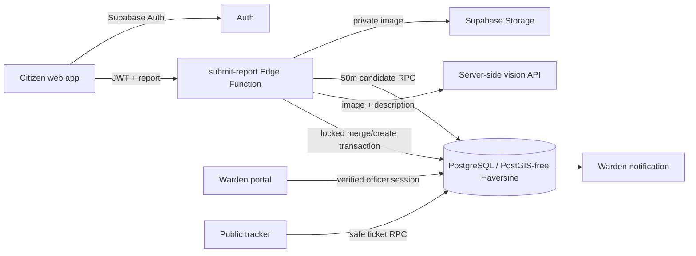

# UrbanGrid

**One Issue. One Ticket. Smarter Cities.**

UrbanGrid is an AI-assisted civic grievance platform. Citizens submit a photo, description and location; nearby reports that show the same real-world problem join one ticket. A ward team gets an in-app alert, updates the work status, and the public can follow the ticket without an account.

> Configure Supabase and the optional server-side OpenAI key using the setup instructions below to enable live services. The sample ward routing data is for Chennai only.

## Problem

Municipal teams receive reports about the same pothole, leak or dumped waste through different channels. Duplicate records obscure community concern, fragment evidence and make it harder to see which issues need attention.

## Solution and features

- Citizen accounts receive a generated `U-00001` style user code.
- Reports include a civic category, description, severity, location and an image stored in a private Supabase Storage bucket.
- An exact Haversine calculation finds active issues within 50 meters. Matching then considers category, image evidence and description with a server-side vision-capable model.
- The database rechecks and writes the merge in one locked transaction. A matched report increments the existing ticket’s report count, adds supporting evidence and updates its transparent priority.
- Ward routing uses seeded ward centers, and ward notifications are stored in Postgres.
- Authorized wardens review their queue, location, supporting report text and signed evidence images. They can advance a status through Pending → Assigned → In Progress → Resolved.
- The public ticket tracker shows the timeline, ward name, priority and report count without requiring sign-in or revealing citizen data or precise coordinates.
- AI outages use a conservative nearby/category/text fallback; an AI response never controls geographic distance or database authorization.

## Architecture



## Tech stack

- React 18, Vite, React Router, Lucide
- Supabase Auth, PostgreSQL, Row Level Security, Storage, Edge Functions
- Optional OpenAI vision-capable chat completions API, called only from an Edge Function
- Haversine geographic distance in PostgreSQL. The deterministic 50m limit is independent of AI.

## AI and duplicate decision

The server first checks for active candidates within 50m. Only same-category candidates are passed for image and description comparison. The AI returns structured signals and a short reason. A candidate is accepted only when it says `same_issue`, confidence is at least 0.76, and at least one of image or description similarity is high. If AI is unavailable, an explicit token-overlap fallback requires a 0.48 Jaccard score as well as the database’s 50m and category checks. If AI rejects a nearby candidate, the new report remains a separate ticket.

The final database transaction locks report processing, rechecks candidate distance/category, writes the supporting report and notification, and prevents parallel first reports with a high textual match from racing into separate tickets. Match evidence returned to the citizen includes distance, image and description labels, category match and confidence.

## Priority rule

The initial report uses its citizen-selected severity. A duplicate makes the issue at least Medium; five or more reports make it High. A Critical issue stays Critical. This small rule is visible and straightforward to explain; cities can replace it with policy-defined weights later.

## Database and routing

Apply `supabase/migrations/202610080001_urbangrid.sql`. It creates profiles, wards, issues, supporting reports, notifications and status history, along with indexes, RLS, private evidence storage and transaction functions. Sample routing centers cover wards 18, 27 and 42 around Chennai. Locations outside the configured Chennai bounds are rejected instead of being silently assigned to a misleading ward. Replace these sample ward centers with municipal-authorized data before using another city.

## Authentication and security

- Citizens sign up through Supabase Auth. The database trigger creates a Citizen profile; the browser never submits a role.
- There is no public Warden registration.
- Municipal admins first provision an Auth user, then authorize it in the database with an officer ID and ward. The Warden sign-in Edge Function resolves the officer ID, confirms an active Warden/Admin profile, then verifies the password with Supabase Auth.
- Every officer operation checks the current server-verified user, role and ward. Service-role credentials exist only as Edge Function secrets.
- Citizen photos are private. Ward evidence is delivered with short-lived signed URLs after a server-side ward authorization check.
- Public ticket details are returned by a restricted database function; citizen identity, exact coordinates, email, phone and image paths are not exposed.
- The `.env` file is ignored by Git. Only the public Supabase URL and anon key use `VITE_` variables.

## Setup

### 1. Create the Supabase project

In a Supabase project, run the migration in the SQL Editor or use the CLI:

```bash
supabase link --project-ref YOUR_PROJECT_REF
supabase db push
```

Configure Auth email/password sign-in and the allowed local/deployment redirect URLs. Email confirmation can be enabled or disabled in Supabase Auth settings for your demo policy.

### 2. Configure the frontend

Create a file named `.env.local` beside `package.json` by copying `.env.example`. In the Supabase Dashboard, open your project’s **Connect** dialog and copy its Project URL and publishable key into that local file:

```text
VITE_SUPABASE_URL=https://YOUR_PROJECT_REF.supabase.co
VITE_SUPABASE_PUBLISHABLE_KEY=YOUR_SB_PUBLISHABLE_KEY
```

The publishable key is meant for browser apps; database Row Level Security remains the access boundary. Never put a secret key, service-role key, or AI API key in a `VITE_` variable. `.env.local` is ignored by Git.

### 3. Configure secure Edge Function secrets

Supabase Edge Functions inject the project URL and key collections automatically. UrbanGrid reads the server secret and publishable key from those runtime values, with a compatibility fallback for legacy keys. Don’t create manual `SUPABASE_*` secrets. Add only your optional AI values under **Project Settings → Edge Functions → Secrets**:

```text
OPENAI_API_KEY = your server-side AI key
OPENAI_MODEL = gpt-4o-mini
```

The AI key is optional. Without it, the report flow continues using the documented deterministic fallback.

### 4. Deploy functions and frontend

The Supabase CLI is included as a local development dependency. From the UrbanGrid project folder, authenticate once with a Supabase Personal Access Token, then deploy all four functions:

```bash
npm.cmd run supabase:login
npm.cmd run deploy:functions
npm.cmd run dev
```

Create the Personal Access Token in your Supabase account settings and enter it only in the CLI prompt. Never paste it into chat, source files, or `.env.local`. The deployment command targets the UrbanGrid project configured in `package.json`. `OPENAI_API_KEY` is optional; without it, issue reports use the deterministic fallback.

In the Supabase Dashboard, open **SQL Editor**, paste and run `supabase/migrations/202610080001_urbangrid.sql` once. Alternatively, link the project and run `supabase db push`.

Deploy the Vite frontend to any static host that supports SPA fallback routing, and set the same two `VITE_` values in its build environment.

## Provision the demo Area Warden

Create an Auth user in Supabase Dashboard → Authentication → Users and set a password. Then run the following SQL as an authorized project administrator, replacing the email and officer ID:

```sql
update public.profiles
set role = 'warden', officer_id = 'WDN-042-001', ward_id = 42
where id = (select id from auth.users where email = 'warden@example.org');

update public.wards
set assigned_warden_id = (select id from public.profiles where officer_id = 'WDN-042-001')
where id = 42;
```

The profile role check constraint blocks incomplete Warden profiles. Provision citizens normally through the app. No demo citizen or password is hardcoded.

## Demo flow

1. Create and confirm two citizen accounts.
2. Submit a pothole report with a photo and a location in one of the configured Chennai wards.
3. Submit another report with the same physical scene, within 50m, from the second citizen.
4. Confirm the second report adds to the original ticket and stores its image as supporting evidence.
5. Sign in as the pre-authorized `WDN-042-001` officer; review the issue, location, photo evidence and notification.
6. Advance status to Assigned, In Progress and Resolved.
7. Open the public tracker and search for the `UG-####` ticket ID.

## Local checks

```bash
npm install
npm run build
```

Live authentication, image storage, AI matching and ticket persistence require project credentials and a deployed Supabase backend; this workspace does not include those credentials.

## Future improvements

- Replace sample centers with municipality-provided ward polygons or a verified ward lookup service.
- Add administrative officer provisioning and audited assignment transfer.
- Add rate limits, abuse review and AI cost controls for public-facing production traffic.
- Add operational map rendering, richer status notes and realtime queue updates.
- Establish retention policy for evidence photos and formal accessibility testing.
